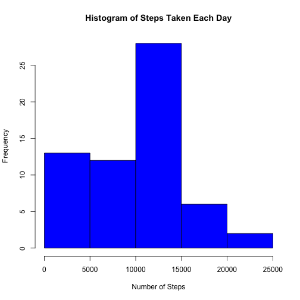
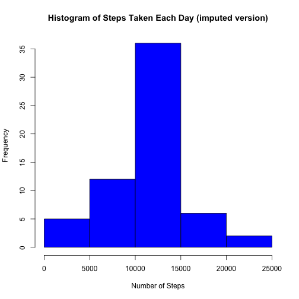
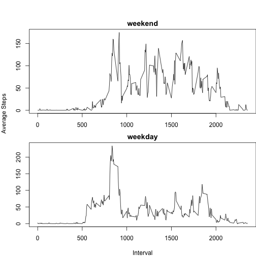

## Loading and preprocessing the data


```r
aData = read.csv("activity.csv", na.string = "NA")
aData$date = as.Date(aData$date, "%Y-%m-%d")
str(aData)
```

```
## 'data.frame':	17568 obs. of  3 variables:
##  $ steps   : int  NA NA NA NA NA NA NA NA NA NA ...
##  $ date    : Date, format: "2012-10-01" "2012-10-01" ...
##  $ interval: int  0 5 10 15 20 25 30 35 40 45 ...
```

## What is the mean total number of steps taken per day?

1. Calculate the total number of steps per day


```r
library(reshape2)
meltData <- melt(aData, id = c("date"))
stepSumData <- dcast(meltData, date ~ variable, sum, na.rm = TRUE)
```

2. Display a histogram of the total number of steps taken each day


```r
hist(stepSumData$step,
     col="blue", 
     main="Histogram of Steps Taken Each Day", 
     xlab="Number of Steps")
```



3. Calculate and report the mean and median of the total number of steps taken per day


```r
meanStep = mean(stepSumData$steps)
medianStep = median(stepSumData$steps)
```

The mean of the total number of steps taken per day is 9354.2295082.  
The median of the total number of steps taken per day is 10395.

## What is the average daily activity pattern?

1. Make a time series plot (i.e. type = "l") of the 5-minute interval (x-axis) and the average number of steps taken, averaged across all days (y-axis)

Calculate the average of steps taken per interval across all days.


```r
meltData2 <- melt(aData, id = "interval")
```

```
## Warning: attributes are not identical across measure variables; they will
## be dropped
```

```r
meanStepData <- dcast(meltData2, interval ~ variable, mean, na.rm = TRUE)
```

Plot the average step per day against interval


```r
plot(steps ~ interval, meanStepData, type = "l")
```


2. Which 5-minute interval, on average across all the days in the dataset, contains the maximum number of steps?


```r
maxIntervalData <- meanStepData[meanStepData$steps == max(meanStepData$steps),]
maxInterval <- maxIntervalData$interval
```

The 5-minute interval that contains maximum number of steps, across all the days in the dataset, is 835.

## Imputing missing values

1. Calculate and report the total number of missing values in the dataset (i.e. the total number of rows with NAs)


```r
totalNA <- sum(is.na(aData$steps))
```

The total number rows with missing values is 2304.

2. Devise a strategy for filling in all of the missing values in the dataset. The strategy does not need to be sophisticated. For example, you could use the mean/median for that day, or the mean for that 5-minute interval, etc.

Will create a new merged data so that the mean of each 5-minute interval can be used to replace the missing values of each interval per day.


```r
mergedData <- merge(aData, meanStepData, by.x = "interval", by.y = "interval")
```

3. Create a new dataset that is equal to the original dataset but with the missing data filled in.

Check the merge data variable, transform to new data by replacing the missing values with the mean value, then remove unwanted columns so the data can be equal to the original one.


```r
str(mergedData)
```

```
## 'data.frame':	17568 obs. of  5 variables:
##  $ interval: int  0 0 0 0 0 0 0 0 0 0 ...
##  $ steps.x : int  NA 0 0 0 0 0 0 0 0 0 ...
##  $ date.x  : Date, format: "2012-10-01" "2012-11-23" ...
##  $ steps.y : num  1.72 1.72 1.72 1.72 1.72 ...
##  $ date.y  : num  15644 15644 15644 15644 15644 ...
```

```r
imputedData = transform(mergedData, steps.x = ifelse(is.na(steps.x), steps.y, steps.x))
imputedData$steps.y <- NULL
imputedData$date.y <- NULL
names(imputedData) <- c("interval", "steps", "date")
```

4. Make a histogram of the total number of steps taken each day and Calculate and report the mean and median total number of steps taken per day. Do these values differ from the estimates from the first part of the assignment? What is the impact of imputing missing data on the estimates of the total daily number of steps?

Calculate the mean and median of total number of steps per day


```r
imputedMeltData <- melt(imputedData, id = c("date"))
imputedStepSumData <- dcast(imputedMeltData, date ~ variable, sum, na.rm = TRUE)
```

Display a histogram of the total number of steps taken each day


```r
hist(imputedStepSumData$step,
     col="Blue", 
     main="Histogram of Steps Taken Each Day (imputed version)", 
     xlab="Number of Steps")
```



Caculate the mean and median of total number of steps taken per day


```r
imputedMean <- mean(imputedStepSumData$steps)
imputedMedian <- median(imputedStepSumData$steps)
```

The mean of the total number of steps taken per day is 1.0766189 &times; 10<sup>4</sup>.  
The median of the total number of steps taken per day is 1.0766189 &times; 10<sup>4</sup>.
  
Impact: Both the mean and median are higher than the original data.  

## Are there differences in activity patterns between weekdays and weekends?

For this part the weekdays() function may be of some help here. Use the dataset with the filled-in missing values for this part.

Create a new factor variable in the dataset with two levels -- "weekday" and "weekend" indicating whether a given date is a weekday or weekend day.

First, copy original dataset to a new dataset. Then identify all dates and factor them into either weekday or weekend.


```r
aData2 <- cbind(aData)
aData2$weekend_or_not <- ifelse(((weekdays(aData2$date) == "Saturday") |   
                                  (weekdays(aData2$date) == "Sunday")),
                                  "weekend",
                                  "weekday")
aData2$weekend_or_not <- as.factor(aData2$weekend_or_not)
```

Make a panel plot containing a time series plot (i.e. type = "l") of the 5-minute interval (x-axis) and the average number of steps taken, averaged across all weekday days or weekend days (y-axis). The plot should look something like the following, which was created using simulated data:

Calculate the average of steps taken per interval across weekdays and weekends.


```r
meltData3 <- melt(aData2, id = c("interval", "weekend_or_not"))
```

```
## Warning: attributes are not identical across measure variables; they will
## be dropped
```

```r
meanStepData2 <- dcast(meltData3, interval + weekend_or_not ~ variable, mean, na.rm = TRUE)
```

Plot the panel plot containing a time series plot.


```r
par(mfcol = c(2, 1), mar = c(0, 0, 4, 0), oma = c(4,4,0,0))
plot(meanStepData2$interval[meanStepData2$weekend_or_not == "weekend"],
     meanStepData2$steps[meanStepData2$weekend_or_not == "weekend"],
     type = "l",
     xlab = "",
     ylab = "")
title("weekend", line = 0.5)
plot(meanStepData2$interval[meanStepData2$weekend_or_not == "weekday"],
     meanStepData2$steps[meanStepData2$weekend_or_not == "weekday"],
     type = "l",
     xlab = "",
     ylab = "")
title("weekday", line = 0.5)
mtext(text="Average Steps", side=2, line=3, outer=TRUE)
mtext(text="Interval", side=1, line=3, outer=TRUE)
```


